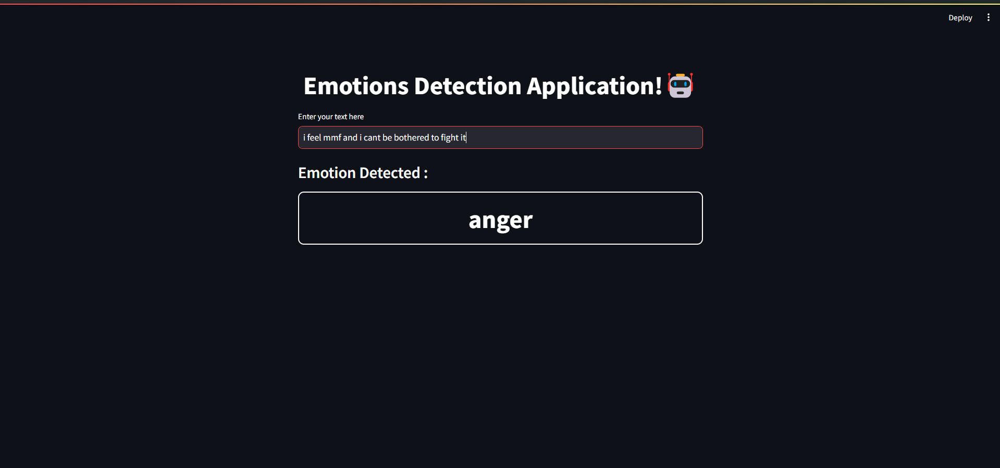

# Emotion Detection Project using ML + NLP + Streamlit.🤖

## This Project demonstrates how to build an AI model to detect emotions in text data. The model is trained on a dataset containing text samples labeled with different emotions such as joy, sadness, anger, fear or netural and deploy it using streamlit to build a web app.



# Dataset📊


The dataset contains three tables: one for training, one for testing, and one for processing. The data is in a text format.

To access the Train dataset click [HERE](https://github.com/sahermuhamed1/Text-Emotion-Detection/blob/main/train.txt)

To access the Test dataset click [HERE](https://github.com/sahermuhamed1/Text-Emotion-Detection/blob/main/test.txt)

To access the Val dataset click [HERE](https://github.com/sahermuhamed1/Text-Emotion-Detection/blob/main/val.txt)

# ML Models🧠

Several machine learning models are trained and evaluated for emotion detection, including:

- Random Forest Classifier
- Logistic Regression
- Support Vector Machine (SVM)
- Voting Classifiet

to access the notebook on kaggle click [HERE](https://www.kaggle.com/code/nextmillionaire/emotion-detection-nlp-ml)

The performance of each model is evaluated using metrics such as accuracy and confusion matrix.

Aftter evaluating all those models I used voting classifier to choose the majority of votes results by the models.


# NLP Text Preprocessing🤖

The following text preprocessing techniques are implemented in this project:

- **Using nltk library in python to remove the unwanted characters and punctuations.
- **Removing Non-Letter Characters**: Remove any characters from the text that are not letters (e.g., punctuation marks, numbers).
- **Converting Words to Lowercase**: Convert all words in the text to lowercase to standardize the text and simplify analysis.
- **Removing Stopwords**: Remove common stopwords (e.g., "the", "and", "is") from the text to reduce noise and improve analysis accuracy.

# Deployment 🛠️

In this project, we utilize Streamlit as our deployment tool to transform our AI model into an interactive dashboard. This platform enables users to input text, triggering our AI model's emotion detection algorithm, providing an analysis of the emotional state of the author of the text.

to access the application [Link](https://text-emotion-detection-sahermuhamed.streamlit.app/)

# Usage🤔

To use the trained emotion detection model:

1. Load the trained model from the provided pickle file.
2. Preprocess the input text by removing non-letter characters, converting words to lowercase, and removing stopwords.
3. Use the trained model to predict the emotion of the preprocessed text.
Example code:
```python
import pickle
import numpy as np

# Load the trained model
with open("emotion_detection_model.pkl", "rb") as file:
    model = pickle.load(file)

# Preprocess the input text
input_text = "I feel overwhelmed with sorrow"
preprocessed_text = preprocess_text(input_text)

# Predict the emotion of the input text
predicted_emotion = model.predict([preprocessed_text])[0]

print("Predicted Emotion:", predicted_emotion)
```

to access the model pickle file click [HERE](https://github.com/sahermuhamed1/Text-Emotion-Detection/blob/main/model.pkl)

to access the model python file click [HERE](https://github.com/sahermuhamed1/Text-Emotion-Detection/blob/main/model.py)

### to makesure that your model runs successfuly you should install both preprocessing and App files:

to download preprocessing file click [HERE](https://github.com/sahermuhamed1/Text-Emotion-Detection/blob/main/preprocessing.py)

to download App file click [HERE](https://github.com/sahermuhamed1/Text-Emotion-Detection/blob/main/App.py)


# Contact info📩
For inquiries or further collaboration, please contact Saher Mohammed at [sahermuhamed176@gmail.com].🥰

[Saher's Linkdin](https://www.linkedin.com/in/sahermuhamed/)

